<h3 align="center"> 
	🚧 Doctor Care 🚀
</h3> 

### 💻 Estrutura de Pastas

````markdown
DOCTORCARE (Pasta Raiz)
├── .github/          (Configurações de CI/CD ou templates do GitHub)
├── assets/           (Pasta de recursos estáticos)
│   ├── doutor-feliz-segurando... (Imagem)
│   ├── homem-negro-com-m...      (Imagem)
│   ├── Logo.svg                  (Logotipo em vetor)
│   └── mulher-negra-com-m...     (Imagem)
├── index.html        (Arquivo principal de marcação)
├── main.js           (Arquivo de lógica e interatividade)
├── Readme.md         (Documentação do projeto)
└── style.css         (Arquivo de estilização)
````

---


<h1 align="center">
    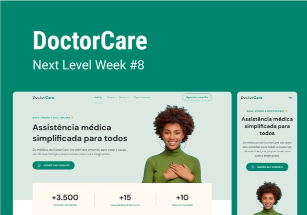
</h1>

### 💻 Sobre o projeto

---

- Desenvolver um site para divulgar a assistência médica com html, css e javascript.
- Utilizar o template do layout a seguir para construir.
<p align="center" style="display: flex; align-items: flex-start; justify-content: center;">
  
  
</p>
- Seguir o paradigma mobile first para desenvolver o layout.
<p align="center" style="display: flex; align-items: flex-start; justify-content: center;">
  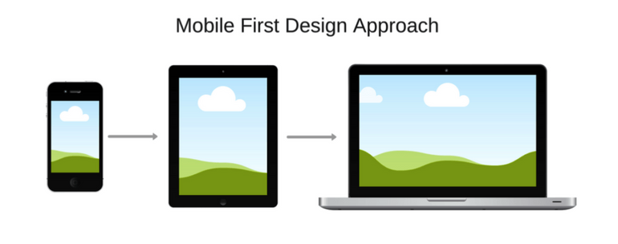
  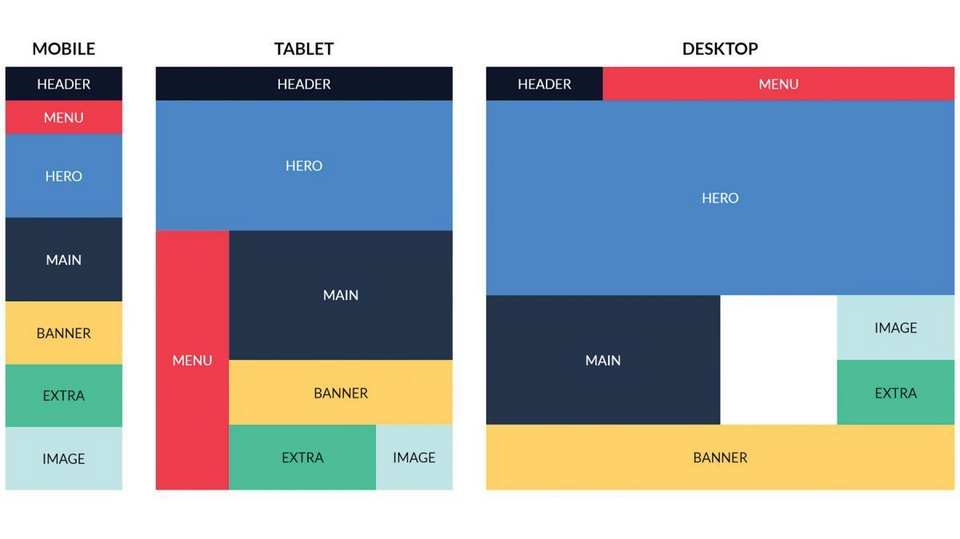
  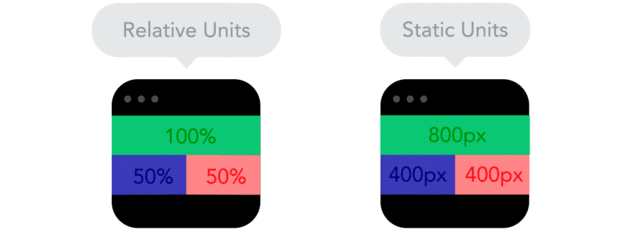
  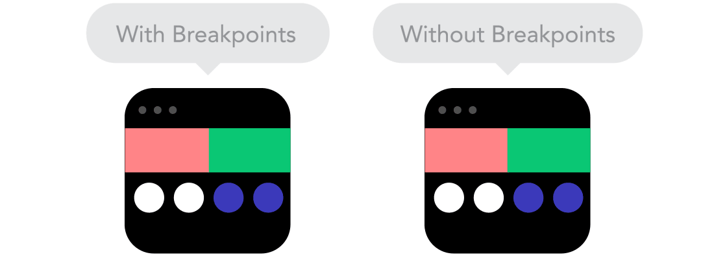
</p>

### 🚀 Layout

---

- Consultar e atender o layout do projeto no [Figma](https://www.figma.com/file/Vs48punE7RrvukfBqE5bj5/DoctorCare-(Community)?node-id=0%3A1).
- Utilizar os assets em `src/assets` para os detalhes do layout. 

### 🚀 Techs

---

- HTML
- CSS
- JavaScript

### 🛠 Construindo 

---  

#### v5.0-doctor-care
- ajustar a estrutura html e css para desktop
- css grid
- css flex
- reestruturar html para ter colunas: col-a e col-b
- medias queries - breakpoints
- projeto hospedado no github pages
- lógicas
- variáveis com let e const
- querySelector e getAttribute
- operador lógico && e de negação !
- operadores de comparação <= e <=
- passar argumento para a função
- Construindo a aplicação em versões.
<p align="center" style="display: flex; align-items: flex-start; justify-content: center;">
  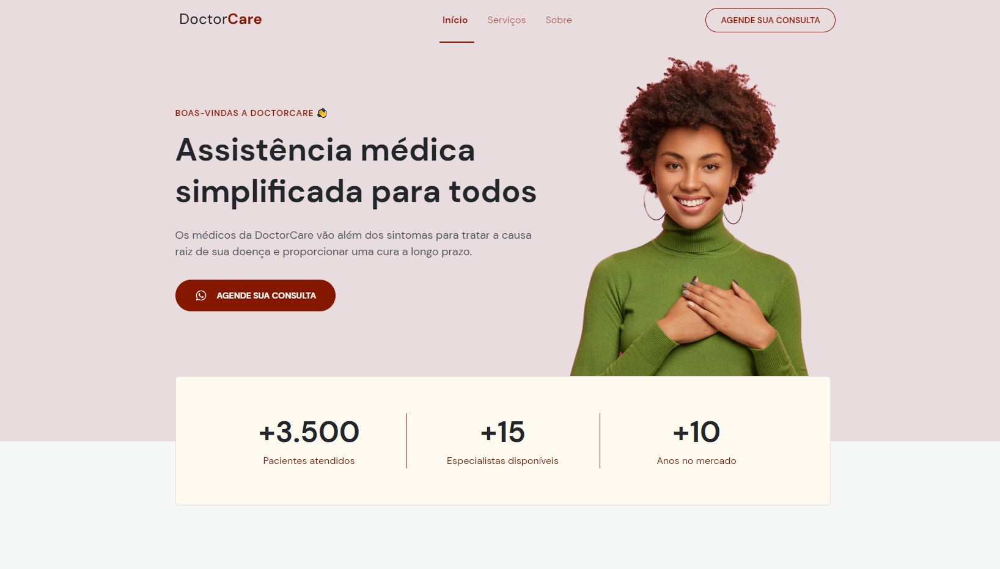
  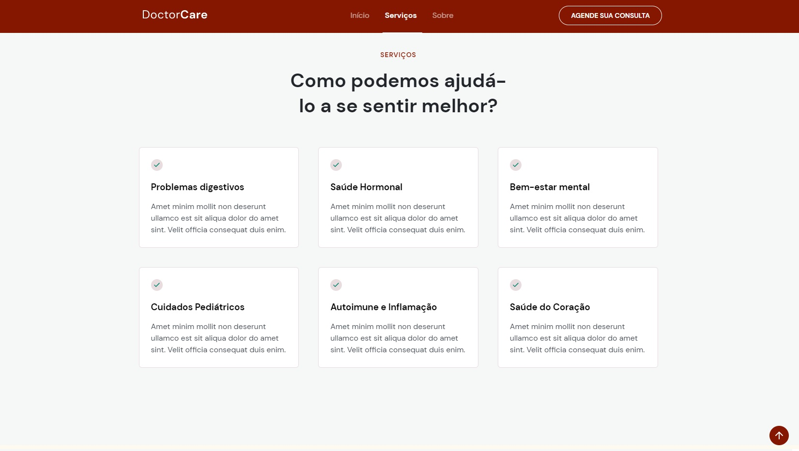
  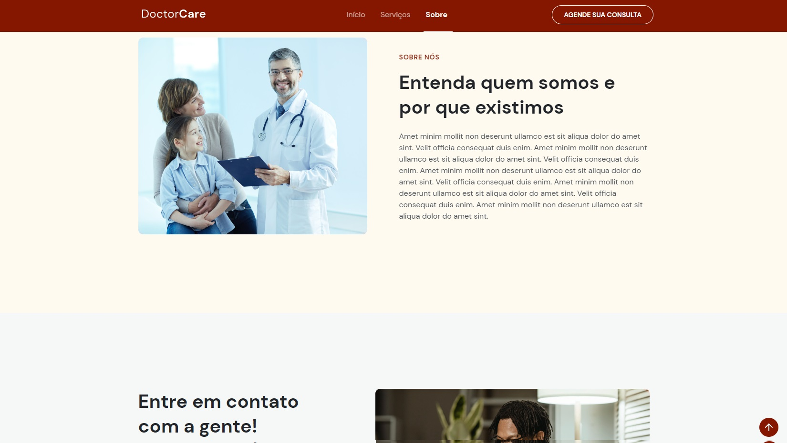
  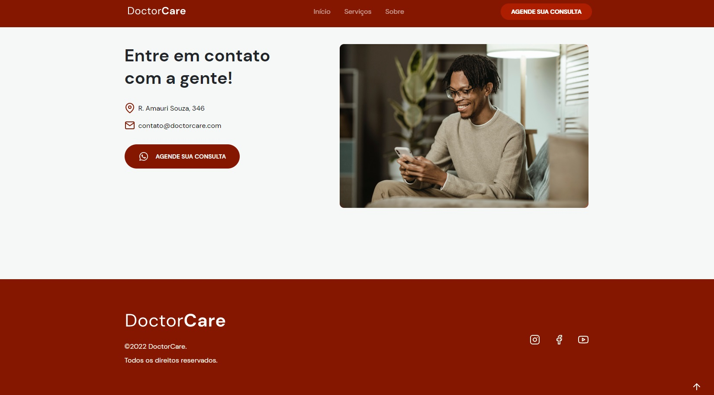
</p>

#### v4.0-doctor-care
- inserir uma variável hue em root para editar as cores
- usar essa variável hue nas propriedades fill e stroke no svg
- seguindo o paradigma mobile first permite liberar a aplicação para o cliente
- seção de contato
- ajustes das imagens
- padronização de botões .button
- footer
- botão de voltar ao topo
- ajustar o carregamento da função onScroll com addEventListener("event", function(){})
- mudança nas cores das imagens e ícones com as propriedades fill e stroke só é possível com svg
- adicionar link para contato via whatsapp com `https://wa.me/5500987654321`
- definir o tamanho do botão com o padding com referência ao conteúdo (width: fit-content)
- a transição do hover com .button{transition: background .2s}
- a tag `a` possui display inline e por isso, margin bottom e top, width e height não são atribuídos. Para resolver, usar display: inline-block
- inserir a class show no botão back to top quando fazer o scroll com scrollY=550
- error: uncaught referenceError: onScroll is not defined at onScroll. Solução: window.addEventListener("scroll",onScroll)
- alterar as cores mantendo a composição do layout utilizando a variável hue.
- alterar a cor das quatro letras da logo, alterando fill e stroke em svg
- error de não subir o arquivo do css: arquivos externos, imagens, ícones devem ser referenciados com "./"
- Construindo a aplicação em versões.
<p align="center" style="display: flex; align-items: flex-start; justify-content: center;">
  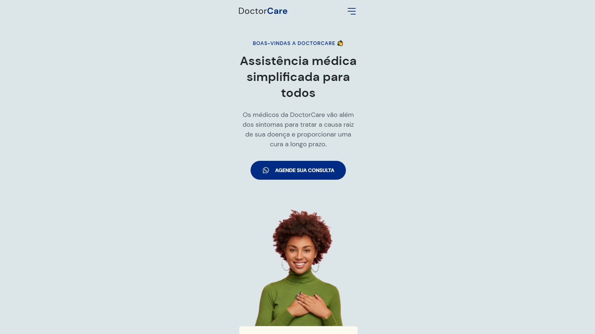
  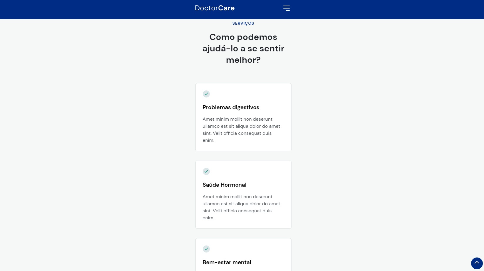
  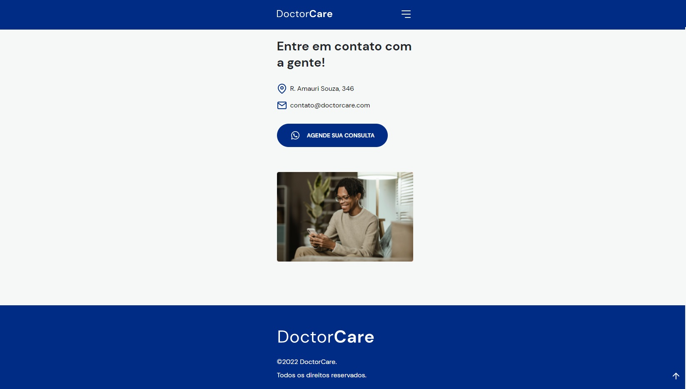
</p>

#### v3.0-doctor-care
- seção de serviços
- html{scroll-behavior: smooth;} a navegação interna na página com a âncora fazendo um deslisar suave.
- transition: property, timing-function, delay e duraction
- efeito do menu cobrindo a viewport e saindo por baixo.
- library scrollReveal para deslizar e exibir o conteúdo com efeito visual.
- padronizar a estrutura html
- tag section
- adicionar âncora
- evento de clique no 
- seção serviços e sobre
- no css seletor id #services e #about
- transições é o coração dessa aplicação landing page
- rolagem suave com smooth scrolling
- melhorias e correções: sobreposições de elementos e menu
- manipular objetos com js
- variáveis 
- tipos de dados
- biblioteca de terceiros
- Construindo a aplicação em versões.
<p align="center" style="display: flex; align-items: flex-start; justify-content: center;">
  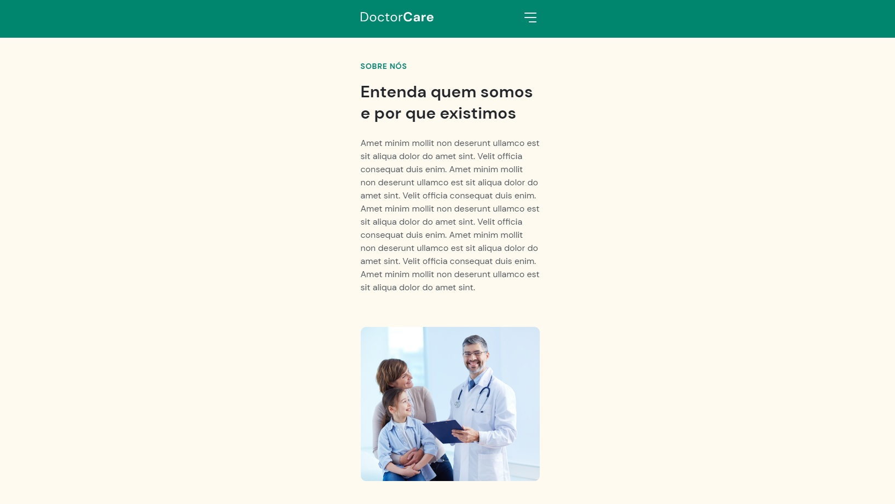
  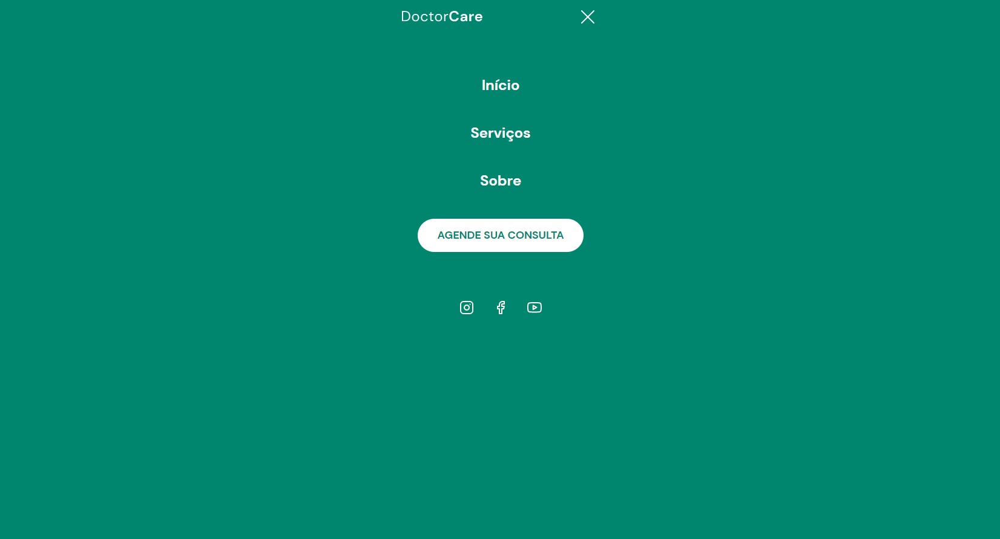
</p>

#### v2.0-doctor-care
- padding-block: na vertical: top e bottom
- margin-inline: na horizontal: left e right
- pseudo element: header::before
- função calc para background
- o elemento nav e sua animação para exibir e recolher no scrollY
- criar o elemento menu que ocupa do vh no clique do ícone
- ul { list-style: none;} para remover a sinalização da lista
- body.menu-expanded{overflow: hidden;} para remover o scroll quando o menu estiver aberto
- .menu .button{text-decoration: none;} para remover o sublinhado do link "a"
- :nth-child(){} irá aplicar os efeitos somente no elemento na posição passada em "n"
- body.menu-expanded > :not(nav) { display: none; } para sumir com todo o conteúdo do primeiro nível (>) filho do body.menu-expanded.
- o botão que exibe e esconde o menu através do onclick: adicionar ou remover uma classe com document.body.classList.add("menu-expanded")
- o scroll do body sobrepõe o conteúdo e não fica no mesmo plano, somando na largura. Assim, não há deslocamento que percebemos no header com a logo: body{ overflow: overlay; }
- Construindo a aplicação em versões.
<p align="center" style="display: flex; align-items: flex-start; justify-content: center;">
  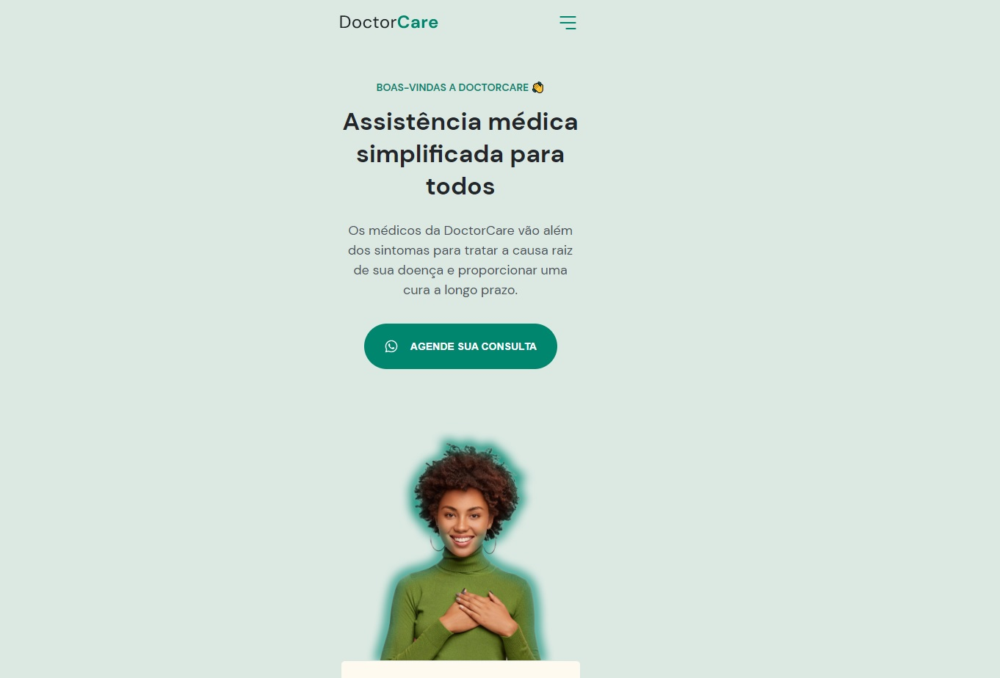
  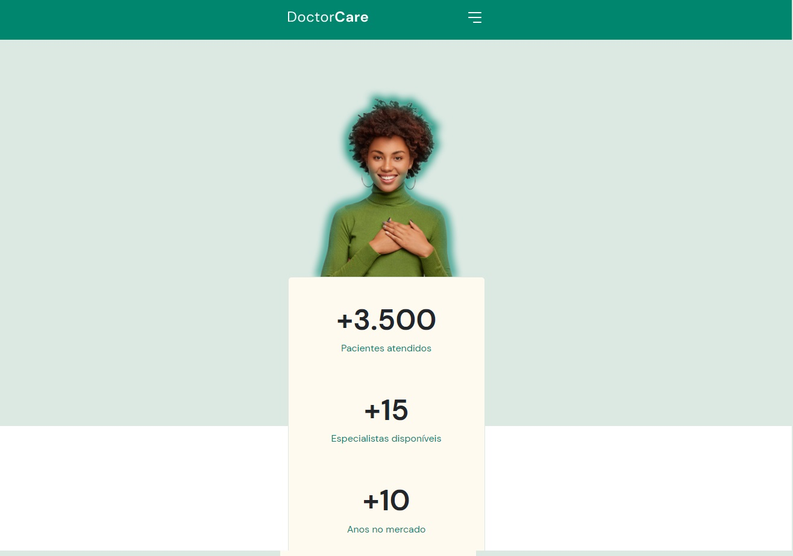
  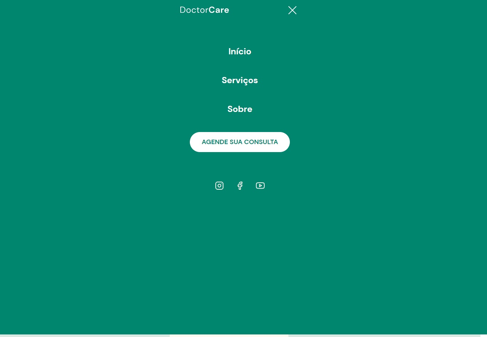
</p>

#### v1.0-doctor-care
- estrutura em html: tags semânticas
- estilização em css: seguindo o mobile first
- google font com link
- variáveis no css para as cores
- unidades fluídas(% e rem) e não fixas(px)
- display flex
- Construindo a aplicação em versões.
<p align="center" style="display: flex; align-items: flex-start; justify-content: center;">
  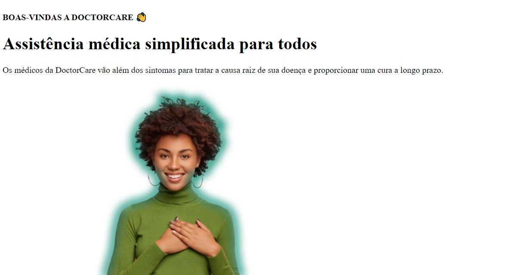
  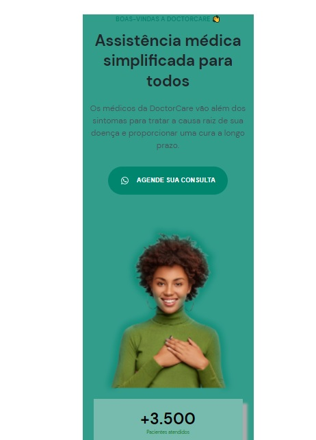
</p>

### 😯 Finalizado 

---  

- Construindo a aplicação em versões.
<p align="center" style="display: flex; align-items: flex-start; justify-content: center;">  
  
</p>

### 🧭 Adicionado

---  

- Hospedado no Github Pages em Versões
- Variação de cores na variável hue

### 💻 Próximo passo

---  

- Criar uma variação desse layout
- Adicionar novas seções, como a de depoimentos.

### 💻 Detalhes

---  

Desafios da trilha Origin 💜 da NLW 8 Return da Rocketseat.

---  

Feito com ❤️ por Douglas A B Novato 👋🏽 [Entre em contato!](https://www.linkedin.com/in/douglasabnovato/)
